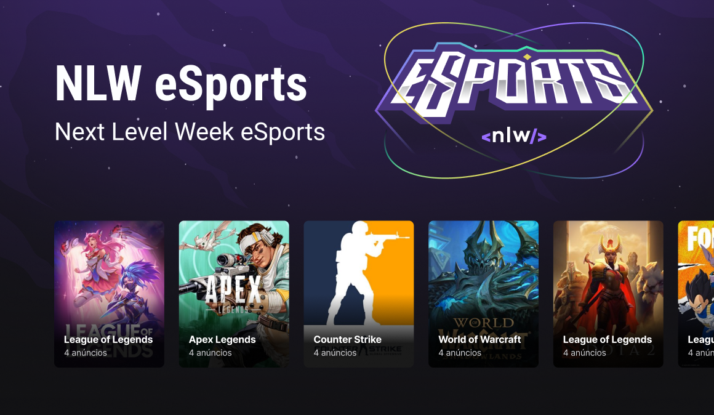

# eSports

<p align="center">
  
  
</p>
<br>

eSports is a application developed on Next Level Week event hosted by [Rocketseat](https://rocketseat.com.br/).

The project goal is to provide a to let the gamers find duos. The user can create a ad on the web application to be available and play someone in the community or search on the mobile app the available ads and match a new duo.

The application has a backend in [NodeJS](https://nodejs.org/) with a [SQlite](https://sqlite.org/) database, a web frontend developed with [ReactJS](https://reactjs.org/) and a mobile app built with [React Native](https://reactnative.dev/) and [Expo](https://expo.dev/).

<div align="center">
  
</div>

## Technologies

- [ReactJS](https://reactjs.org/)
- [React Native](https://reactnative.dev/)
- [NodeJS](https://nodejs.org/)
- [Expo](https://expo.dev/)
- [Express](https://expressjs.com/)
- [Prisma](https://prisma.io/)
- [SQlite](https://sqlite.org/)

## Getting Started

Install de dependencies on `mobile`, `server` and `web` applications:

```sh
npm install
```

Create a `.env` file on `server` application root:

```
DATABASE_URL="file:../database/db.sqlite"
```

Load the .env variables on prisma:

```sh
npx prisma generate
```

LogIn on expo:

```sh
expo login
```

## Next Level

- [ ] Responsiveness
- [ ] Games carrousel (Keen-Slider)
- [ ] Feedback toast (Radix UI)
- [ ] Form validation (React Hook Form, Zod)
- [ ] SSO Auth
- [ ] Adds push notifications on back-end

## License

This project is licensed under the MIT. Consult the [LICENSE](LICENSE) for more information.
